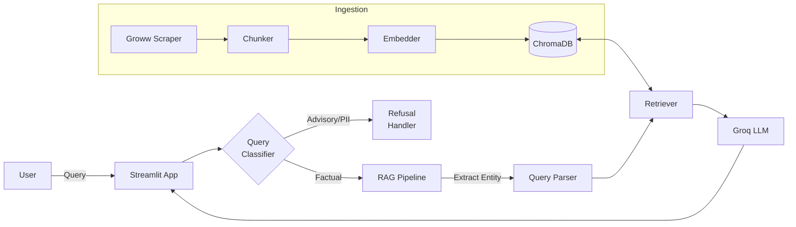

# Mutual Fund FAQ Assistant

## ⚠️ Disclaimer
**Facts-only. No investment advice.** This application is designed solely to retrieve and display factual information about mutual fund schemes. It does not provide financial recommendations, buy/sell advice, or performance predictions. Always consult a certified financial advisor before making investment decisions.

---

## Description
A Retrieval-Augmented Generation (RAG) chatbot designed to answer factual questions about specific HDFC Mutual Fund schemes. The assistant scrapes latest data directly from Groww, processes and embeds the text, and uses an LLM to answer questions precisely while citing the source URL.

## Selected AMC
**HDFC Asset Management Company (AMC)**

## Selected Schemes
| Scheme Name | Category |
|-------------|----------|
| HDFC Large Cap Fund – Direct Growth | Equity |
| HDFC Mid Cap Fund – Direct Growth | Equity |
| HDFC Small Cap Fund – Direct Growth | Equity |
| HDFC Gold ETF Fund of Fund – Direct Growth | Commodities |
| HDFC Silver ETF FoF – Direct Growth | Commodities |

## Architecture
This project implements a complete RAG pipeline with custom web scraping, section-based chunking, embedding via ChromaDB, and generation via Groq API. 

For full details, see the [Architecture Document](docs/Architecture.md).



## Setup Instructions

1. **Clone the repository:**
   ```bash
   git clone <repository_url>
   cd "RAG chatbot"
   ```

2. **Set up a virtual environment (optional but recommended):**
   ```bash
   python -m venv venv
   source venv/bin/activate  # On Windows use `venv\Scripts\activate`
   ```

3. **Install dependencies:**
   ```bash
   pip install -r requirements.txt
   ```

4. **Environment Variables:**
   Create a `.env` file in the root directory using the template below:
   ```env
   # .env
   GROQ_API_KEY=your_groq_api_key_here
   ```

## How to Run

To launch the web interface:
```bash
python -m streamlit run src/app.py
```
This will start the Streamlit server, accessible at `http://localhost:8501`.

## How to Re-Scrape & Ingest Data

A daily background job via GitHub Actions automatically keeps the database updated at 10:30 AM IST every day.
To manually trigger a full re-scrape and re-ingestion locally, run:

```bash
# 1. Scrape latest data from Groww
python -m src.scraper.groww_scraper

# 2. Chunk the new data
python -m src.ingestion.chunker

# 3. Embed and store in ChromaDB
python -m src.ingestion.embedder
```

## Known Limitations

- **Scope:** Currently only supports the 5 specified HDFC mutual funds. Queries outside this scope are politely rejected.
- **Calculations:** The assistant cannot calculate future returns, compound interest, or perform live portfolio analysis. It only retrieves facts.
- **LLM Hallucinations:** Despite guardrails and a strict `temperature=0.0` configuration, language models may occasionally formulate answers incorrectly. Always refer to the cited source URL for authoritative information.
- **Scraper Fragility:** The scraper relies on the HTML structure of Groww's pages. Significant UI changes on their website may break the ingestion pipeline.
