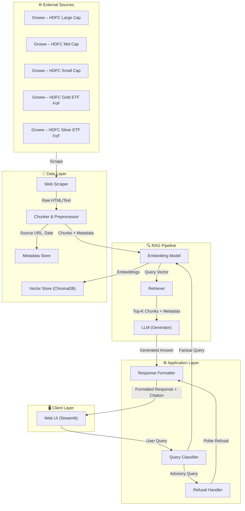
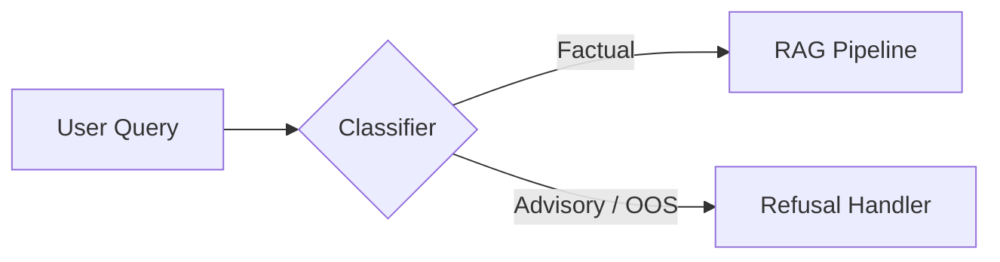
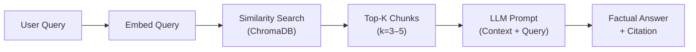
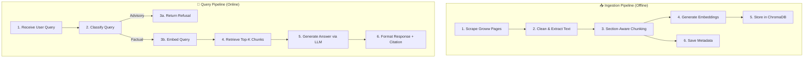
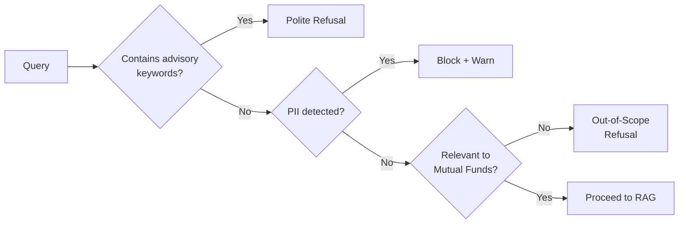

# Architecture: Mutual Fund FAQ Assistant

> RAG-based facts-only Q&A system for HDFC mutual fund schemes via Groww

---

## 1. High-Level Architecture



---

## 2. Component Breakdown

### 2.1 Client Layer — Web UI

| Attribute     | Detail                                   |
|---------------|------------------------------------------|
| **Framework** | Streamlit                                |
| **Purpose**   | Minimal chat interface for user queries  |

**Features:**

- Welcome message with project context
- 3 pre-filled example questions (clickable)
- Persistent disclaimer banner: *"Facts-only. No investment advice."*
- Chat-style input/output with source citations
- Footer with last-updated date on every response

---

### 2.2 Application Layer

#### Query Classifier

Determines whether an incoming query is **factual** or **advisory/out-of-scope** before it enters the RAG pipeline.



| Approach       | Detail |
|----------------|--------|
| **Method**     | Keyword + intent heuristics, backed by an LLM classification prompt |
| **Advisory signals** | "should I", "which is better", "recommend", "worth it", "good investment" |
| **Fallback**   | If confidence is low, default to refusal (safe-side) |

#### Refusal Handler

Returns a polite, templated refusal for advisory or out-of-scope queries.

**Response template:**
> *"I can only provide factual information about mutual fund schemes. I'm unable to offer investment advice or recommendations. For guidance, please visit [AMFI](https://www.amfiindia.com) or [SEBI Investor Education](https://investor.sebi.gov.in)."*

#### Response Formatter

Assembles the final response with:

1. **Answer** — max 3 sentences, factual only
2. **Citation** — exactly 1 source link
3. **Footer** — `"Last updated from sources: <date>"`

---

### 2.3 RAG Pipeline

#### Data Flow



#### Embedding Model

| Attribute     | Detail |
|---------------|--------|
| **Model**     | `BAAI/bge-small-en-v1.5` |
| **Dimension** | 384 |
| **Why**        | High-quality embeddings, top-ranked on MTEB benchmark, lightweight and fast for factual retrieval |

#### Retriever

| Attribute       | Detail |
|-----------------|--------|
| **Vector Store** | ChromaDB (local, persistent) |
| **Search Type**  | Cosine similarity |
| **Top-K**        | 3–5 chunks |
| **Metadata filter** | Filter by scheme name if detected in query |

#### LLM (Generator)

| Attribute     | Detail |
|---------------|--------|
| **Model**     | Groq API (`llama-3.1-8b-instant`) |
| **Temperature** | 0.0 (deterministic, factual) |
| **Max tokens** | 200 |
| **Why Groq**   | Ultra-low latency inference via LPU, generous free tier, ideal for real-time chat |

**System Prompt (condensed):**
> You are a facts-only mutual fund assistant. Answer using ONLY the provided context. Keep answers to 3 sentences max. Include exactly one source URL from the context metadata. Never give investment advice. If the context doesn't contain the answer, say "I don't have this information in my sources."

---

### 2.4 Data Layer

#### Web Scraper

| Attribute     | Detail |
|---------------|--------|
| **Library**   | `BeautifulSoup4` + `requests` (or `Selenium` for JS-rendered pages) |
| **Targets**   | 5 Groww scheme pages |
| **Output**    | Cleaned text + metadata (URL, scrape date) |

**Source URLs:**

| # | URL |
|---|-----|
| 1 | `https://groww.in/mutual-funds/hdfc-large-cap-fund-direct-growth` |
| 2 | `https://groww.in/mutual-funds/hdfc-mid-cap-fund-direct-growth` |
| 3 | `https://groww.in/mutual-funds/hdfc-small-cap-fund-direct-growth` |
| 4 | `https://groww.in/mutual-funds/hdfc-gold-etf-fund-of-fund-direct-plan-growth` |
| 5 | `https://groww.in/mutual-funds/hdfc-silver-etf-fof-direct-growth` |

#### Chunker & Preprocessor

| Attribute         | Detail |
|-------------------|--------|
| **Strategy**      | Section-aware chunking (split by logical sections on the page) |
| **Chunk size**    | ~300–500 tokens |
| **Overlap**       | 50 tokens |
| **Metadata per chunk** | `source_url`, `scheme_name`, `section_title`, `scrape_date` |

#### Vector Store — ChromaDB

| Attribute       | Detail |
|-----------------|--------|
| **Storage**     | Local persistent directory (`./chroma_db/`) |
| **Collection**  | `hdfc_mutual_funds` |
| **Document fields** | `text`, `embedding`, `metadata` |

#### Metadata Store

Maintains a lightweight JSON/SQLite record of:

```json
{
  "scheme_name": "HDFC Large Cap Fund – Direct Growth",
  "source_url": "https://groww.in/mutual-funds/hdfc-large-cap-fund-direct-growth",
  "last_scraped": "2026-07-13",
  "chunk_count": 12
}
```

---

## 3. Project Structure

```
RAG chatbot/
├── docs/
│   ├── problemStatement.md
│   ├── problemStatement.txt
│   └── Architecture.md
├── src/
│   ├── app.py                  # Streamlit UI entry point
│   ├── scraper/
│   │   ├── __init__.py
│   │   └── groww_scraper.py    # Web scraping logic
│   ├── ingestion/
│   │   ├── __init__.py
│   │   ├── chunker.py          # Text chunking & preprocessing
│   │   └── embedder.py         # Embedding generation & ChromaDB ingestion
│   ├── retrieval/
│   │   ├── __init__.py
│   │   └── retriever.py        # Vector search & context retrieval
│   ├── generation/
│   │   ├── __init__.py
│   │   ├── llm_client.py       # LLM API wrapper
│   │   └── prompt_templates.py # System & user prompt templates
│   ├── classifier/
│   │   ├── __init__.py
│   │   └── query_classifier.py # Factual vs advisory classification
│   └── utils/
│       ├── __init__.py
│       ├── config.py           # Centralised configuration
│       └── formatter.py        # Response formatting (citations, footer)
├── data/
│   ├── raw/                    # Raw scraped HTML/text
│   ├── processed/              # Cleaned & chunked text
│   └── metadata.json           # Scrape metadata registry
├── chroma_db/                  # ChromaDB persistent storage
├── requirements.txt
├── .env                        # API keys (gitignored)
├── .gitignore
└── README.md
```

---

## 4. Data Pipeline



### Ingestion Pipeline (Offline — Run Once / On-Demand)

| Step | Action | Tool/Library |
|------|--------|-------------|
| 1 | Scrape 5 Groww URLs | `requests` + `BeautifulSoup4` |
| 2 | Strip HTML, extract scheme info sections | Custom parser |
| 3 | Chunk text (~300–500 tokens, 50 overlap) | `langchain.text_splitter` |
| 4 | Generate embeddings | `sentence-transformers` (BGE) |
| 5 | Upsert into ChromaDB | `chromadb` |
| 6 | Record scrape date & chunk count | `metadata.json` |

### Query Pipeline (Online — Per Request)

| Step | Action | Tool/Library |
|------|--------|-------------|
| 1 | Accept query from Streamlit chat | `streamlit` |
| 2 | Classify as factual / advisory | Heuristics + LLM prompt |
| 3a | Return polite refusal + AMFI/SEBI link | Template |
| 3b | Embed query | `sentence-transformers` (BGE) |
| 4 | Cosine similarity search, top-K | `chromadb` |
| 5 | Send context + query to LLM | Groq API |
| 6 | Append citation + footer | `formatter.py` |

---

## 5. Technology Stack

| Layer          | Technology | Purpose |
|----------------|-----------|---------|
| **UI**         | Streamlit | Minimal chat interface |
| **Language**   | Python 3.10+ | Core development |
| **Scraping**   | BeautifulSoup4, requests | Web content extraction |
| **Chunking**   | LangChain TextSplitter | Section-aware text splitting |
| **Embeddings** | sentence-transformers (`BAAI/bge-small-en-v1.5`) | Semantic vector generation |
| **Vector DB**  | ChromaDB | Local persistent vector storage |
| **LLM**        | Groq API (`llama-3.1-8b-instant`) | Ultra-low latency answer generation |
| **Config**     | python-dotenv | Environment variable management |

---

## 6. Guardrails & Compliance

### Query-Level Guardrails



| Guardrail | Implementation |
|-----------|---------------|
| **Advisory filter** | Keyword blocklist + LLM classification |
| **PII detection** | Regex patterns for PAN, Aadhaar, phone, email, account numbers |
| **Scope filter** | Reject queries unrelated to mutual funds |
| **Hallucination prevention** | Temperature = 0, strict context-only prompt, fallback "I don't have this information" |
| **Response length** | Hard cap at 3 sentences via prompt + post-processing |
| **Citation enforcement** | Response must contain exactly 1 URL from chunk metadata |

### Privacy Safeguards

- **No PII storage** — queries containing PII are blocked before processing
- **No logging of user data** — only anonymised query counts for debugging
- **API keys** stored in `.env`, never committed to version control

---

## 7. Response Format Specification

Every successful response follows this exact structure:

```
┌─────────────────────────────────────────────┐
│  <Answer — max 3 sentences, factual only>   │
│                                             │
│  📎 Source: <single citation URL>           │
│  🕐 Last updated from sources: <date>       │
└─────────────────────────────────────────────┘
```

Every refusal response follows this structure:

```
┌─────────────────────────────────────────────┐
│  I can only provide factual information     │
│  about mutual fund schemes. I'm unable to   │
│  offer investment advice or recommendations.│
│                                             │
│  📚 Learn more: <AMFI/SEBI link>           │
└─────────────────────────────────────────────┘
```

---

## 8. Known Limitations

| Limitation | Impact | Mitigation |
|-----------|--------|-----------|
| Data freshness depends on scrape frequency | Stale expense ratios or NAVs | Display `last_scraped` date; re-scrape on demand |
| Groww pages may be JS-rendered | Scraper may miss dynamic content | Fallback to Selenium if `requests` yields incomplete data |
| Only 5 schemes covered | Narrow coverage | Clearly scope in UI; refuse queries about other schemes |
| LLM may hallucinate details | Incorrect factual answers | Temperature 0, strict context-only prompt, validation layer |
| No real-time NAV data | Users may expect live prices | Redirect to Groww/AMFI for live data |

---

## 9. Future Enhancements

| Enhancement | Description |
|-------------|-------------|
| **Scheduled scraping** | Cron job to re-scrape sources weekly and re-index |
| **Multi-AMC support** | Extend corpus to other AMCs (ICICI, SBI, Axis) |
| **Hybrid search** | Combine vector search with BM25 keyword search |
| **Feedback loop** | Thumbs up/down on responses for quality tracking |
| **API endpoint** | FastAPI wrapper for integration with other products |
| **Caching** | Cache frequent queries to reduce LLM API costs |
