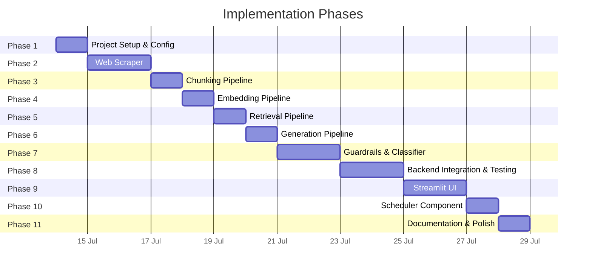
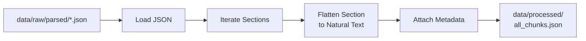
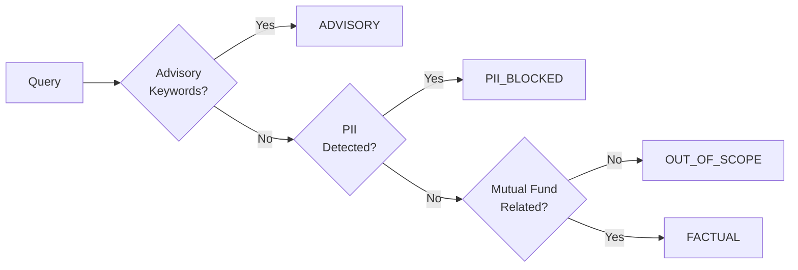
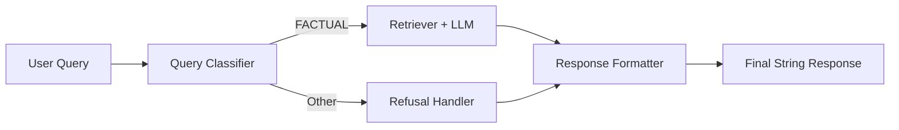
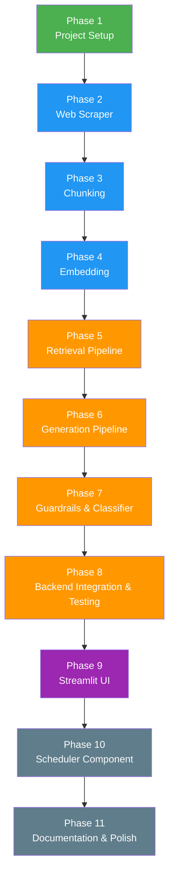

# Implementation Plan: Mutual Fund FAQ Assistant

> Phase-wise breakdown aligned with [Architecture.md](file:///Users/raunaqkaicker/Documents/RAG%20chatbot/docs/Architecture.md)

---

## Phase Overview



| Phase | Name | Duration | Key Deliverable |
|-------|------|----------|-----------------|
| 1 | Project Setup & Configuration | 1 day | Skeleton repo, dependencies, config system |
| 2 | Web Scraper | 2 days | Scraped & cleaned data from 5 Groww URLs |
| 3 | Chunking Pipeline | 1 day | Section-aware chunks with metadata in `data/processed/` |
| 4 | Embedding Pipeline | 1 day | Embeddings generated & stored in ChromaDB |
| 5 | Retrieval Pipeline | 1 day | Query parsing and metadata-filtered ChromaDB retrieval |
| 6 | Generation Pipeline | 1 day | LLM client, prompt templates, and response generation |
| 7 | Guardrails & Query Classifier | 2 days | Advisory/PII/scope filtering |
| 8 | Backend Integration & Testing | 2 days | Fully connected backend with 15 test cases passing |
| 9 | Streamlit UI | 2 days | Working chat interface connecting to backend |
| 10 | Scheduler Component | 1 day | GitHub Actions workflow to trigger daily ingestion at 10:30 AM IST |
| 11 | Documentation & Polish | 1 day | README, final cleanup |

**Total estimated duration: ~16 days**

---

## Phase 1 — Project Setup & Configuration

> **Goal:** Establish the project skeleton, install dependencies, and create the config system.

### Tasks

- [ ] Create the full directory structure as defined in Architecture §3

```
RAG chatbot/
├── src/
│   ├── app.py
│   ├── scraper/
│   │   ├── __init__.py
│   │   └── groww_scraper.py
│   ├── ingestion/
│   │   ├── __init__.py
│   │   ├── chunker.py
│   │   └── embedder.py
│   ├── retrieval/
│   │   ├── __init__.py
│   │   └── retriever.py
│   ├── generation/
│   │   ├── __init__.py
│   │   ├── llm_client.py
│   │   └── prompt_templates.py
│   ├── classifier/
│   │   ├── __init__.py
│   │   └── query_classifier.py
│   └── utils/
│       ├── __init__.py
│       ├── config.py
│       └── formatter.py
├── data/
│   ├── raw/
│   ├── processed/
│   └── metadata.json
├── chroma_db/
├── requirements.txt
├── .env
├── .gitignore
└── README.md
```

- [ ] Create `requirements.txt`

```
streamlit
requests
beautifulsoup4
langchain
langchain-text-splitters
sentence-transformers
chromadb
groq
python-dotenv
```

- [ ] Create `.env` template

```env
GROQ_API_KEY=your_groq_api_key_here
```

- [ ] Create `.gitignore`

```
.env
__pycache__/
chroma_db/
data/raw/
*.pyc
```

- [ ] Implement `src/utils/config.py`

| Config Key | Value | Source |
|-----------|-------|--------|
| `CORPUS_URLS` | List of 5 Groww URLs | Hardcoded |
| `CHROMA_DB_PATH` | `./chroma_db/` | `.env` or default |
| `CHROMA_COLLECTION` | `hdfc_mutual_funds` | Hardcoded |
| `LLM_MODEL` | `llama-3.1-8b-instant` | `.env` |
| `LLM_TEMPERATURE` | `0.0` | Hardcoded |
| `LLM_MAX_TOKENS` | `200` | Hardcoded |
| `EMBEDDING_MODEL` | `BAAI/bge-small-en-v1.5` | Hardcoded |
| `CHUNK_SIZE` | `400` | Hardcoded |
| `CHUNK_OVERLAP` | `50` | Hardcoded |
| `TOP_K` | `4` | Hardcoded |

- [ ] Install dependencies and verify imports

### Deliverables

- ✅ Project skeleton with all directories and empty module files
- ✅ `requirements.txt` with pinned dependencies
- ✅ `.env` template and `.gitignore`
- ✅ Centralised `config.py`

---

## Phase 2 — Web Scraper

> **Goal:** Scrape all 5 Groww scheme pages and store cleaned text with metadata.

### Architecture Reference

> Architecture §2.4 — Web Scraper

### Tasks

- [ ] Implement `src/scraper/groww_scraper.py`

| Function | Purpose |
|---------|---------|
| `scrape_url(url: str) -> dict` | Fetch a single Groww page, return raw HTML |
| `parse_scheme_page(html: str, url: str) -> dict` | Extract structured sections (fund info, expense ratio, exit load, SIP details, risk, benchmark, etc.) |
| `scrape_all_schemes() -> list[dict]` | Iterate over all 5 corpus URLs, scrape & parse each |
| `save_raw_data(data: list[dict], path: str)` | Persist raw text to `data/raw/` as individual `.txt` files |

- [ ] Handle the following **sections** per Groww page:

| Section | Data Points |
|---------|-------------|
| Fund Overview | Fund name, category, AMC, plan type |
| Returns | 1Y, 3Y, 5Y returns (factsheet link only — no calculations) |
| Fund Details | Expense ratio, exit load, min SIP, min lumpsum, lock-in |
| Risk | Riskometer category |
| Benchmark | Benchmark index name |
| Holdings | Top holdings summary |
| Tax | Tax implications info |

- [ ] Handle edge cases:
  - [ ] JS-rendered content fallback (try `requests` first; flag for Selenium if incomplete)
  - [ ] HTTP errors, timeouts, retries (max 3)
  - [ ] Rate limiting (1-second delay between requests)

- [ ] Generate `data/metadata.json` with scrape results:

```json
[
  {
    "scheme_name": "HDFC Large Cap Fund – Direct Growth",
    "source_url": "https://groww.in/mutual-funds/hdfc-large-cap-fund-direct-growth",
    "last_scraped": "2026-07-15T10:00:00Z",
    "status": "success",
    "sections_extracted": 7,
    "raw_file": "data/raw/hdfc_large_cap.txt"
  }
]
```

### Deliverables

- ✅ Working scraper for all 5 Groww URLs
- ✅ Cleaned text files in `data/raw/`
- ✅ `data/metadata.json` with scrape audit trail

### Verification

```bash
python -m src.scraper.groww_scraper
# Should produce 5 .txt files in data/raw/ and update metadata.json
```

---

## Phase 3 — Chunking Pipeline

> **Goal:** Convert parsed JSON data into semantically coherent, section-based chunks ready for embedding.

### Architecture Reference

> Architecture §2.4 — Chunker & Preprocessor

### Data Analysis

The parsed JSON files in `data/raw/parsed/` contain **10 consistent sections** per fund:

| Section | Avg Size (words) | Content Type | Notes |
|---------|-----------------|--------------|-------|
| `fund_overview` | ~50–80 | Key-value pairs | Name, category, AMC, ISIN, risk level |
| `fund_details` | ~60–90 | Key-value pairs | NAV, expense ratio, exit load, min SIP |
| `returns` | ~100–150 | Nested numbers | CAGR, category avg, rankings, SIP returns, risk metrics |
| `risk` | ~20–30 | Key-value pairs | Riskometer, std dev, beta |
| `benchmark` | ~10–15 | Key-value pairs | Benchmark index name |
| `holdings` | ~80–200 | Lists + key-value | Top 10 stocks, sector/asset allocation (equity funds only) |
| `tax` | ~30–50 | Prose sentence(s) | Tax implication rules |
| `fund_management` | ~60–120 | List of bios | Fund manager names + backgrounds |
| `amc_info` | ~30–40 | Key-value pairs | AMC contact details |
| `analysis` | ~30–50 | Lists | Groww's pros and cons |

**Key observations:**
- Total data per fund: **376–584 words** (~500–750 tokens)
- Each section is **small and self-contained** (50–200 words)
- Data is **already structured JSON** — no need for text splitters that guess boundaries
- `RecursiveCharacterTextSplitter` on `.txt` files would blindly split across sections, causing mid-sentence breaks, overlap duplication, and metadata misattribution

### Chunking Strategy: Section-Based from Parsed JSON

Instead of using a text splitter on `.txt` files, chunk **directly from the parsed JSON** — one chunk per section per fund.



| Parameter | Value | Rationale |
|-----------|-------|-----------|
| **Chunk granularity** | 1 section = 1 chunk | Sections are already semantically coherent units |
| **Source** | `data/raw/parsed/*.json` | Structured JSON, not raw `.txt` |
| **Overlap** | None needed | Sections don't share context; each is self-contained |
| **Max chunk size** | ~200 words (~250 tokens) | Largest section (`holdings`) stays well under BGE's 512 token limit |
| **Text splitter** | Not needed | Sections are small enough to be single chunks |
| **Text format** | Flattened natural language | Convert key-value JSON to readable sentences (see below) |

> [!IMPORTANT]
> **Why not `RecursiveCharacterTextSplitter`?** Our sections are small, discrete data blocks (not long-form prose). A text splitter would introduce overlap noise and split data points that belong together (e.g., splitting "Exit Load" from its value). Section-based chunking keeps each chunk a complete, answerable unit.

### Tasks

#### Chunker (`src/ingestion/chunker.py`)

- [ ] Load parsed JSON files from `data/raw/parsed/`
- [ ] Iterate each fund's `sections` dict — one chunk per section
- [ ] Flatten each section's JSON into natural-language text with the fund name prepended:

**Example — `fund_details` section for HDFC Large Cap:**

```
Input JSON:
{
    "nav": "₹1228.902",
    "expense_ratio": "1.02%",
    "exit_load": "Exit load of 1% if redeemed within 1 year",
    "min_sip_investment": "₹100",
    ...
}

Output text:
"HDFC Large Cap Fund – Direct Growth: Fund Details.
NAV: ₹1228.902 (as of 14-Jul-2026). AUM: ₹39,023.69 Cr.
Expense Ratio: 1.02%. Exit Load: Exit load of 1% if redeemed
within 1 year. Min SIP Investment: ₹100. Min Lumpsum Investment:
₹100. Lock-in Period: No lock-in period."
```

- [ ] Handle special sections that need custom flattening:

| Section | Special Handling |
|---------|-----------------|
| `returns` | Flatten nested sub-sections (CAGR, category avg, SIP returns) into separate sub-chunks **or** a single combined chunk |
| `holdings` | Flatten top-10 list + sector allocation into readable sentences |
| `risk` + `benchmark` | **Merge** into a single chunk (both are very small, ~30 words combined) |
| `fund_management` | Flatten manager list into bio sentences |

- [ ] Attach metadata to every chunk:

```python
{
    "id": "hdfc_large_cap__fund_details",  # deterministic ID for upsert
    "text": "HDFC Large Cap Fund – Direct Growth: Fund Details. NAV: ₹1228.902...",
    "metadata": {
        "source_url": "https://groww.in/mutual-funds/hdfc-large-cap-fund-direct-growth",
        "scheme_name": "HDFC Large Cap Fund – Direct Growth",
        "section": "fund_details",
        "scrape_date": "2026-07-14",
        "chunk_index": 1,
        "word_count": 85
    }
}
```

- [ ] Save all chunks to `data/processed/all_chunks.json`
- [ ] Save per-fund chunks to `data/processed/<fund_slug>_chunks.json`

| Function | Purpose |
|---------|---------| 
| `load_parsed_json(path: str) -> list[dict]` | Read parsed JSON files from `data/raw/parsed/` |
| `flatten_section(section_name: str, data: dict, scheme_name: str) -> str` | Convert a section's JSON to natural-language text |
| `chunk_fund(parsed_data: dict) -> list[dict]` | Create all chunks for a single fund |
| `chunk_all_funds(parsed_dir: str) -> list[dict]` | Process all 5 funds, return all chunks |
| `save_chunks(chunks: list, output_dir: str)` | Save to `data/processed/` |
| `run_chunking_pipeline()` | Orchestrate: load → chunk → save |

### Expected Output

| Metric | Value |
|--------|-------|
| **Chunks per equity fund** | ~9 sections → ~8–9 chunks (after merging risk+benchmark) |
| **Chunks per commodity fund** | ~8 sections → ~7–8 chunks (smaller holdings section) |
| **Total chunks** | ~40–45 across 5 funds |
| **Avg chunk size** | ~60–150 words (~80–200 tokens) |
| **Max chunk size** | ~200 words (~250 tokens) — `holdings` for equity funds |

### Deliverables

- ✅ `all_chunks.json` in `data/processed/` with all chunks across 5 funds
- ✅ Per-fund chunk files in `data/processed/` for easier review
- ✅ Each chunk is a self-contained, answerable unit with full metadata
- ✅ Deterministic chunk IDs for idempotent re-ingestion
- ✅ Chunking pipeline runnable as a single command

### Verification

```bash
python -m src.ingestion.chunker
# Expected output:
# "Chunked 5 funds into 42 chunks, saved to data/processed/"
# "  HDFC Large Cap Fund – Direct Growth: 9 chunks"
# "  HDFC Mid Cap Fund – Direct Growth: 9 chunks"
# "  HDFC Small Cap Fund – Direct Growth: 9 chunks"
# "  HDFC Gold ETF Fund of Fund – Direct Growth: 8 chunks"
# "  HDFC Silver ETF FoF – Direct Growth: 8 chunks"
```

```python
# Quick validation
import json
with open("data/processed/all_chunks.json") as f:
    chunks = json.load(f)
print(f"Total chunks: {len(chunks)}")             # ~40-45
print(f"Sections: {set(c['metadata']['section'] for c in chunks)}")
print(f"Avg words: {sum(c['metadata']['word_count'] for c in chunks) / len(chunks):.0f}")
# Verify every chunk has required metadata keys
for c in chunks:
    assert all(k in c["metadata"] for k in ["source_url", "scheme_name", "section", "scrape_date"])
```

---

## Phase 4 — Embedding Pipeline

> **Goal:** Generate embeddings for all chunks and store them in ChromaDB.

### Architecture Reference

> Architecture §2.4 — Vector Store

### Tasks

#### Embedder (`src/ingestion/embedder.py`)

- [ ] Load embedding model: `BAAI/bge-small-en-v1.5`
- [ ] Generate 384-dim embeddings for each chunk
- [ ] Upsert into ChromaDB:

| ChromaDB Config | Value |
|----------------|-------|
| Persist directory | `./chroma_db/` |
| Collection name | `hdfc_mutual_funds` |
| Distance metric | Cosine |

| Function | Purpose |
|---------|---------|
| `get_embedding_model() -> SentenceTransformer` | Load/cache the model |
| `embed_chunks(chunks: list[dict]) -> list[list[float]]` | Generate embeddings |
| `store_in_chroma(chunks, embeddings, metadata)` | Upsert to ChromaDB |
| `run_embedding_pipeline()` | Orchestrate: load chunks → embed → store |

- [ ] Update `metadata.json` with `chunk_count` per scheme

### Deliverables

- ✅ ChromaDB populated with embedded chunks + metadata
- ✅ Embedding pipeline runnable as a single command
- ✅ `metadata.json` updated with chunk counts

### Verification

```bash
python -m src.ingestion.embedder
# Should ingest all chunks and print summary:
# "Embedded and stored N chunks across 5 schemes into ChromaDB"
```

```python
# Quick validation
import chromadb
client = chromadb.PersistentClient(path="./chroma_db")
collection = client.get_collection("hdfc_mutual_funds")
print(collection.count())  # Should be > 0
```

---

## Phase 5 — Retrieval Pipeline

> **Goal:** Build an intelligent retrieval strategy utilizing query parsing and metadata filtering.

### Architecture Reference

> Architecture §2.3 — RAG Pipeline (Retrieval component)

### Retrieval Strategy

Given our section-based chunks with rich metadata, basic semantic search is insufficient. We will implement a structured retrieval strategy:

1. **Query Parsing**: Extract key entities like `scheme_name` (e.g., "HDFC Large Cap") from the user's query.
2. **Metadata Filtering**: Apply a hard filter in ChromaDB (`where={"scheme_name": "..."}`) to prevent retrieving facts from the wrong fund, avoiding cross-fund hallucination.
3. **Semantic Search**: Embed the query and retrieve the top-K chunks using cosine similarity from the filtered subset.
4. **Relevancy Thresholding**: Drop results with a cosine distance above a certain threshold to ensure only highly relevant context is passed to the LLM.

### Tasks

#### 5a. Query Parser (`src/retrieval/query_parser.py`)

- [ ] Implement a lightweight entity extractor (regex-based or fast LLM call) to identify the target fund in the query.
- [ ] Map recognized fund names to exact `scheme_name` metadata values.

| Function | Purpose |
|---------|---------|
| `extract_scheme_name(query: str) -> Optional[str]` | Identify specific fund mentioned in query |

#### 5b. Retriever (`src/retrieval/retriever.py`)

- [ ] Connect to ChromaDB persistent store
- [ ] Implement query embedding + similarity search with filtering

| Function | Purpose |
|---------|---------|
| `retrieve(query: str, top_k: int = 4) -> list[dict]` | Embed query, apply metadata filter if `scheme_name` is found, return top-K chunks |

- [ ] Return format per result:

```python
{
    "text": "The exit load for HDFC Mid Cap is 1% if redeemed within 1 year...",
    "source_url": "https://groww.in/mutual-funds/hdfc-mid-cap-fund-direct-growth",
    "scheme_name": "HDFC Mid Cap Fund – Direct Growth",
    "section": "fund_details",
    "distance": 0.13
}
```

### Deliverables

- ✅ Query parser to detect target schemes
- ✅ Working retriever with cosine search and dynamic metadata filtering

### Verification

```bash
python -c "from src.retrieval.retriever import retrieve; print(retrieve('expense ratio HDFC Large Cap'))"
# Should return relevant chunks specifically filtered to HDFC Large Cap
```

---

## Phase 6 — Generation Pipeline

> **Goal:** Connect the retrieval system to the LLM to generate factual, sourced answers.

### Architecture Reference

> Architecture §2.3 — RAG Pipeline (Generation component)

### Tasks

#### 6a. Prompt Templates (`src/generation/prompt_templates.py`)

- [ ] Define system prompt:

```python
SYSTEM_PROMPT = """You are a facts-only mutual fund FAQ assistant for HDFC schemes listed on Groww.

RULES:
1. Answer using ONLY the provided context. Do not use outside knowledge.
2. Keep your answer to a MAXIMUM of 3 sentences.
3. Include exactly ONE source URL from the context metadata as a citation.
4. NEVER provide investment advice, recommendations, or opinions.
5. If the context does not contain the answer, respond:
   "I don't have this information in my current sources."
6. Do not perform return calculations or performance comparisons.
"""
```

- [ ] Define user prompt template:

```python
USER_PROMPT = """Context:
{context}

Question: {query}

Answer (max 3 sentences, include source URL):"""
```

#### 6b. LLM Client (`src/generation/llm_client.py`)

- [ ] Implement LLM wrapper using Groq API:

| Function | Purpose |
|---------|---------|
| `get_llm_client() -> LLMClient` | Initialise Groq client with API key |
| `generate_answer(system_prompt, user_prompt) -> str` | Send prompt, return raw answer with retry logic |

- [ ] Config:

| Parameter | Value |
|-----------|-------|
| Temperature | 0.0 |
| Max tokens | 200 |
| Model | `llama-3.3-70b-versatile` (via Groq) |

- [ ] Implement Rate Limiting & Retry Logic to respect Groq limits:
  - **30 Requests per Minute (RPM)**
  - **12,000 Tokens per Minute (TPM)**
  - **1,000 Requests per Day (RPD)**
  - **100,000 Tokens per Day (TPD)**
  - Use `tenacity` (e.g. `@retry(wait=wait_exponential(min=1, max=10))`) to handle `429 Too Many Requests`.
  - Ensure context length is strictly capped to not exceed TPM limits.

#### 6c. End-to-End RAG Function

- [ ] Create orchestration function:

```python
def ask(query: str) -> dict:
    """
    Full RAG pipeline:
    1. Parse query for scheme_name
    2. Retrieve top-K context chunks (filtered)
    3. Build prompt with context
    4. Generate answer via LLM
    5. Format response with citation + footer
    """
```

### Deliverables

- ✅ LLM client with Groq API support
- ✅ Prompt templates enforcing facts-only constraints
- ✅ `ask()` function returning formatted answers

### Verification

```bash
python -c "from src.generation.llm_client import ask; print(ask('What is the expense ratio of HDFC Large Cap Fund?'))"
# Should return a 1-3 sentence factual answer with citation
```

---

## Phase 7 — Guardrails & Query Classifier

> **Goal:** Add safety layers — advisory detection, PII blocking, scope filtering.

### Architecture Reference

> Architecture §6 — Guardrails & Compliance

### Tasks

#### 7a. Query Classifier (`src/classifier/query_classifier.py`)

- [ ] Implement classification pipeline:



| Function | Purpose |
|---------|---------|
| `classify_query(query: str) -> QueryType` | Returns enum: `FACTUAL`, `ADVISORY`, `PII_BLOCKED`, `OUT_OF_SCOPE` |
| `_check_advisory(query: str) -> bool` | Keyword + pattern matching for advisory intent |
| `_check_pii(query: str) -> bool` | Regex for PAN, Aadhaar, phone, email, account numbers |
| `_check_scope(query: str) -> bool` | Relevance check for mutual fund domain |

- [ ] Advisory keyword blocklist:

```python
ADVISORY_KEYWORDS = [
    "should i invest", "which is better", "recommend",
    "worth it", "good investment", "best fund", "suggest",
    "better option", "compare returns", "which one",
    "buy or sell", "right time", "safe to invest"
]
```

- [ ] PII regex patterns:

| PII Type | Pattern |
|---------|---------|
| PAN | `[A-Z]{5}[0-9]{4}[A-Z]{1}` |
| Aadhaar | `\b\d{4}\s?\d{4}\s?\d{4}\b` |
| Phone | `\b[6-9]\d{9}\b` |
| Email | Standard email regex |
| Account No. | `\b\d{9,18}\b` (contextual) |

#### 7b. Refusal Handler (extend `src/utils/formatter.py`)

- [ ] Implement refusal templates:

| Query Type | Response Template |
|-----------|------------------|
| `ADVISORY` | "I can only provide factual information about mutual fund schemes. I'm unable to offer investment advice or recommendations. For guidance, please visit [AMFI](https://www.amfiindia.com) or [SEBI Investor Education](https://investor.sebi.gov.in)." |
| `PII_BLOCKED` | "For your security, please do not share personal information like PAN, Aadhaar, or account numbers. I can help with factual queries about HDFC mutual fund schemes." |
| `OUT_OF_SCOPE` | "I can only answer questions about HDFC mutual fund schemes listed on Groww. Please ask a question related to fund details like expense ratio, exit load, SIP amounts, or risk classification." |

#### 7c. Response Formatter (`src/utils/formatter.py`)

- [ ] Implement final response assembly:

| Function | Purpose |
|---------|---------|
| `format_response(answer: str, source_url: str, scrape_date: str) -> str` | Assemble answer + citation + footer |
| `format_refusal(query_type: QueryType) -> str` | Return appropriate refusal message |
| `validate_response(response: str) -> bool` | Check: ≤3 sentences, has URL, has footer |

### Deliverables

- ✅ Query classifier handling 4 query types
- ✅ PII detection with regex
- ✅ Advisory keyword filter
- ✅ Refusal handler with polite templates
- ✅ Response formatter with validation

### Verification

```python
from src.classifier.query_classifier import classify_query

assert classify_query("What is the expense ratio of HDFC Large Cap?") == "FACTUAL"
assert classify_query("Should I invest in HDFC Mid Cap?") == "ADVISORY"
assert classify_query("My PAN is ABCDE1234F") == "PII_BLOCKED"
assert classify_query("What is the weather today?") == "OUT_OF_SCOPE"
```

---

## Phase 8 — Backend Integration & Testing

> **Goal:** Connect all backend components, perform end-to-end testing, and handle edge cases before exposing to the UI.

### Tasks

#### 8a. Backend Integration (`src/backend_app.py`)

- [ ] Wire all backend modules together into a central function:



- [ ] Ensure error handling at every boundary:

| Boundary | Error Handling |
|---------|---------------|
| Scraper → Network | Retry 3x, timeout 10s, log failures |
| ChromaDB → Disk | Check DB exists before query, re-ingest if missing |
| LLM API → Network | Timeout 30s, fallback message on failure, rate limit handling |
| User Input → Classifier | Handle empty input, very long input (truncate at 500 chars) |

#### 8b. Test Cases

##### Factual Queries (Should Answer)

| # | Query | Expected Behaviour |
|---|-------|--------------------|
| 1 | "What is the expense ratio of HDFC Large Cap Fund?" | Returns expense ratio + source link |
| 2 | "What is the exit load for HDFC Small Cap Fund?" | Returns exit load details + source link |
| 3 | "What is the minimum SIP amount for HDFC Mid Cap Fund?" | Returns SIP minimum + source link |
| 4 | "What benchmark does HDFC Gold ETF FoF track?" | Returns benchmark name + source link |
| 5 | "What is the risk category of HDFC Silver ETF FoF?" | Returns riskometer classification + source link |

##### Advisory Queries (Should Refuse)

| # | Query | Expected Behaviour |
|---|-------|--------------------|
| 6 | "Should I invest in HDFC Large Cap Fund?" | Polite refusal + AMFI/SEBI link |
| 7 | "Which is better — HDFC Mid Cap or Small Cap?" | Polite refusal |
| 8 | "Is HDFC Gold ETF a good investment?" | Polite refusal |

##### PII Queries (Should Block)

| # | Query | Expected Behaviour |
|---|-------|--------------------|
| 9 | "My PAN is ABCDE1234F, check my portfolio" | PII warning, no processing |
| 10 | "My phone number is 9876543210" | PII warning |

##### Out-of-Scope Queries (Should Refuse)

| # | Query | Expected Behaviour |
|---|-------|--------------------|
| 11 | "What is the weather in Mumbai?" | Out-of-scope refusal |
| 12 | "Tell me about SBI Blue Chip Fund" | Out-of-scope (wrong AMC) |

##### Edge Cases

| # | Query | Expected Behaviour |
|---|-------|--------------------|
| 13 | "" (empty) | Prompt user to ask a question |
| 14 | Very long input (1000+ chars) | Truncate and process |
| 15 | "expense ratio" (no scheme name) | Return results for best-matching scheme |

#### 8c. Response Validation

- [ ] Verify every response programmatically:
  - [ ] Contains ≤ 3 sentences
  - [ ] Contains exactly 1 citation URL (for factual answers)
  - [ ] Contains "Last updated from sources: \<date\>" footer
  - [ ] No investment advice language

### Deliverables

- ✅ All backend modules integrated and error-handled in `src/backend_app.py`
- ✅ 15 test cases passing against the backend orchestrator
- ✅ Response validation checks implemented

### Verification

```bash
python -m pytest tests/test_backend.py
# Verify all edge cases pass without relying on the UI
```

---

## Phase 9 — Streamlit UI

> **Goal:** Build a minimal, clean chat interface to interact with the integrated backend.

### Architecture Reference

> Architecture §2.1 — Client Layer

### Tasks

- [ ] Implement `src/app.py` — Streamlit entry point

#### UI Layout

```text
┌──────────────────────────────────────────────┐
│  🏦 Mutual Fund FAQ Assistant                │
│  ⚠️ Facts-only. No investment advice.        │
├──────────────────────────────────────────────┤
│                                              │
│  Welcome! I can answer factual questions     │
│  about HDFC mutual fund schemes on Groww.    │
│                                              │
│  Try asking:                                 │
│  ┌──────────────────────────────────────┐    │
│  │ What is the expense ratio of HDFC    │    │
│  │ Large Cap Fund?                      │    │
│  ├──────────────────────────────────────┤    │
│  │ What is the exit load for HDFC       │    │
│  │ Small Cap Fund?                      │    │
│  ├──────────────────────────────────────┤    │
│  │ What is the minimum SIP amount for   │    │
│  │ HDFC Mid Cap Fund?                   │    │
│  └──────────────────────────────────────┘    │
│                                              │
│  💬 User: What is the exit load for HDFC     │
│           Mid Cap Fund?                      │
│                                              │
│  🤖 Bot: The exit load for HDFC Mid Cap      │
│     Fund is 1% if redeemed within 1 year     │
│     from the date of allotment. No exit      │
│     load is charged after 1 year.            │
│                                              │
│     📎 Source: https://groww.in/...           │
│     🕐 Last updated from sources: 2026-07-15 │
│                                              │
├──────────────────────────────────────────────┤
│  Type your question...                  [➤]  │
└──────────────────────────────────────────────┘
```

#### Component Breakdown

| Component | Implementation |
|-----------|---------------|
| **Header** | `st.title()` + `st.warning()` for disclaimer |
| **Welcome message** | `st.markdown()` with greeting text |
| **Example questions** | 3× `st.button()` — clicking auto-fills the chat |
| **Chat history** | `st.session_state.messages` list |
| **Chat input** | `st.chat_input()` |
| **Response display** | `st.chat_message()` with formatted answer |
| **Spinner** | `st.spinner("Searching sources...")` during backend query |

- [ ] Wire up the Streamlit UI to the central backend orchestrator (`src/backend_app.py`)
- [ ] Add session state for chat history persistence
- [ ] Style with `st.set_page_config(page_title="MF FAQ Assistant", page_icon="🏦", layout="centered")`

### Deliverables

- ✅ Working Streamlit chat UI interacting with the integrated backend
- ✅ Disclaimer banner always visible
- ✅ 3 clickable example questions
- ✅ Chat history maintained in session

### Verification

```bash
streamlit run src/app.py
# Should open browser with chat interface
# Test: ask queries and visually verify correct UI behavior and chat history.
```

---

## Phase 10 — Scheduler Component

> **Goal:** Automate the ingestion pipeline (scraper, chunker, embedder) to run daily for fresh data.

### Tasks

- [ ] Create a GitHub Actions workflow `.github/workflows/daily_ingestion.yml`
- [ ] Configure the workflow to run on a daily schedule at 10:30 AM IST using `cron` (`0 5 * * *`).
- [ ] Define the steps to checkout the repo, set up Python, and install dependencies.
- [ ] Sequentially trigger the ingestion scripts:
  1. Web Scraper (`python -m src.scraper.groww_scraper`)
  2. Chunking Pipeline (`python -m src.ingestion.chunker`)
  3. Embedding Pipeline (`python -m src.ingestion.embedder`)
- [ ] Commit and push the updated ChromaDB and metadata back to the repository.

### Deliverables

- ✅ Working GitHub Actions workflow file
- ✅ Daily automated updates to ChromaDB

---

## Phase 11 — Documentation & Polish

> **Goal:** Finalize README, clean up code, add final touches.

### Tasks

- [x] Write `README.md`:

| Section | Content |
|---------|---------|
| Project Title | Mutual Fund FAQ Assistant |
| Description | Facts-only RAG chatbot for HDFC schemes via Groww |
| Architecture | High-level diagram + link to Architecture.md |
| Selected AMC | HDFC AMC |
| Selected Schemes | Table of 5 schemes |
| Setup Instructions | Step-by-step local setup |
| Environment Variables | `.env` template |
| How to Run | `streamlit run src/app.py` |
| How to Re-Scrape | `python -m src.scraper.groww_scraper` |
| Known Limitations | List from Architecture §8 |
| Disclaimer | "Facts-only. No investment advice." |

- [x] Code cleanup:
  - [x] Add docstrings to all public functions
  - [x] Remove debug `print()` statements
  - [x] Consistent code formatting (run `black` or `ruff`)
  - [x] Type hints on all function signatures

- [x] Final polish:
  - [x] Verify `.gitignore` covers all sensitive/generated files
  - [x] Ensure `metadata.json` has accurate last-scraped dates
  - [x] Test fresh setup from clone (install → scrape → ingest → run)

### Deliverables

- ✅ Complete `README.md`
- ✅ Clean, documented codebase
- ✅ Verified fresh-install workflow

---

## Summary — Phase Dependencies



> **Note:** All phases are sequential.
